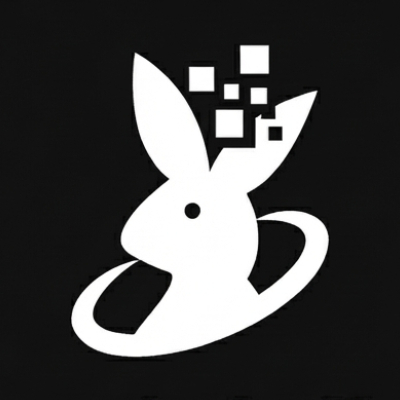

# RabbitLLM



**Run 70B+ LLMs on a single 4GB GPU — no quantization required.**

[](https://pypi.org/project/rabbitllm/)
[](https://www.python.org/)
[](LICENSE)
[](https://github.com/manuelslemos/rabbitllm/actions)
[](https://buymeacoffee.com/l5gr4mn)

RabbitLLM is a **fork of [AirLLM](https://github.com/lyogavin/airllm)**. It enables inference on large language models (70B+ parameters) on consumer GPUs with as little as 4GB VRAM by streaming model layers one at a time through GPU memory. No quantization, distillation, or pruning needed — full model quality.

### Compatibility (current status)

- **Tested and supported:** only **Qwen2** and **Qwen3** are currently tested and compatible. Use these families for reliable results.
- **Other architectures** (Llama, Mistral, Mixtral, etc.) are present in the codebase but **not yet compatible** — use at your own risk.
- **Apple (macOS / Apple Silicon)** is **not supported**; run on Linux or Windows with a CUDA-capable GPU (or CPU fallback on x86/ARM Linux).

## How it works

Instead of loading the entire model into GPU memory, RabbitLLM:

1. **Splits** the HuggingFace checkpoint into per-layer safetensors files (once, on first use).
2. **Streams** each layer individually: load to GPU → forward pass → free GPU memory.
3. **Prefetches** the next layer in a background thread while the current layer is computing.

Optional 4-bit/8-bit block-wise compression (via bitsandbytes) can reduce layer size further
for up to **3× speed-up** with minimal accuracy loss.

## Installation

```bash
pip install rabbitllm
```

**Optional — Flash Attention 2** (faster on Ampere+ GPUs, e.g. RTX 30xx/40xx):

```bash
pip install rabbitllm[flash]
```

If the prebuilt wheel is unavailable for your setup, install from
[flashattn.dev](https://flashattn.dev). Without it, SDPA is used automatically.

## Quickstart

```python
import warnings
import torch
from rabbitllm import AutoModel

# Use GPU if available, otherwise CPU
with warnings.catch_warnings():
    warnings.filterwarnings("ignore", message=".*CUDA.*unknown error.*", category=UserWarning)
    device = "cuda:0" if torch.cuda.is_available() else "cpu"

# compression: "4bit" (recommended), "8bit", or None (bfloat16)
model = AutoModel.from_pretrained(
    "Qwen/Qwen2.5-0.5B-Instruct",
    device=device,
    compression="4bit",
)

messages = [
    {"role": "system", "content": "You are a helpful assistant."},
    {"role": "user",   "content": "What is the capital of France?"},
]

input_text = model.tokenizer.apply_chat_template(
    messages, tokenize=False, add_generation_prompt=True
)
tokens = model.tokenizer(
    [input_text], return_tensors="pt", truncation=True, max_length=512
)
input_ids = tokens["input_ids"].to(device)
attention_mask = tokens.get("attention_mask")
if attention_mask is None:
    attention_mask = torch.ones_like(input_ids, dtype=torch.long, device=device)
else:
    attention_mask = attention_mask.to(device)

output = model.generate(
    input_ids,
    attention_mask=attention_mask,
    max_new_tokens=200,
    use_cache=True,
    do_sample=True,
    temperature=0.6,
    top_p=0.95,
    return_dict_in_generate=True,
)

# Decode only the newly generated tokens
input_len = tokens["input_ids"].shape[1]
print(model.tokenizer.decode(output.sequences[0][input_len:], skip_special_tokens=True))
```

`AutoModel` automatically detects the model architecture from the HuggingFace config —
no need to pick the right class manually.

## Supported models

**Only Qwen2 and Qwen3 are tested and supported.** The following table lists the architectures present in the codebase; others are not yet compatible.

| Family | Architectures | Class | Status |
|---|---|---|---|
| **Qwen2 / Qwen2.5 / Qwen3** | `Qwen2ForCausalLM`, `Qwen3ForCausalLM` | `RabbitLLMQWen2` | **Tested, supported** |
| Llama 2 / 3 / 3.1 / 3.2 | `LlamaForCausalLM` | `RabbitLLMLlama2` | Not yet compatible |
| Qwen v1 | `QWenLMHeadModel` | `RabbitLLMQWen` | Not yet compatible |
| Mistral | `MistralForCausalLM` | `RabbitLLMMistral` | Not yet compatible |
| Mixtral | `MixtralForCausalLM` | `RabbitLLMMixtral` | Not yet compatible |
| InternLM | `InternLMForCausalLM` | `RabbitLLMInternLM` | Not yet compatible |
| ChatGLM | `ChatGLMModel` | `RabbitLLMChatGLM` | Not yet compatible |
| Baichuan | `BaichuanForCausalLM` | `RabbitLLMBaichuan` | Not yet compatible |
| Gemma 2 / 3 | `Gemma2ForCausalLM`, `Gemma3ForCausalLM` | `RabbitLLMLlama2` | Not yet compatible |
| DeepSeek V2 / V3 | `DeepseekV2ForCausalLM`, `DeepseekV3ForCausalLM` | `RabbitLLMLlama2` | Not yet compatible |
| Phi 2 / 3 / 4 | `Phi3ForCausalLM`, `Phi4ForCausalLM` | `RabbitLLMLlama2` | Not yet compatible |

Unknown architectures fall back to the Llama-based implementation with a warning.

## Configuration

```python
model = AutoModel.from_pretrained(
    "Qwen/Qwen2.5-72B-Instruct",
    compression="4bit",          # "4bit" | "8bit" | None (default)
    attn_implementation="auto",  # "auto" | "flash_attention_2" | "sdpa" | "eager"
    max_seq_len=512,             # maximum sequence length
    prefetching=True,            # overlap layer loading with compute
    prefetch_pin_memory=True,    # faster CPU→GPU for small/medium models
    token="hf_...",              # HuggingFace token for gated repos
    layer_shards_saving_path="/path/to/cache",  # custom split cache directory
    profiling_mode=False,        # print per-layer timing
    delete_original=False,       # delete original shards after splitting
)
```

### Compression

Block-wise quantization reduces on-disk and in-memory layer size:

- **4-bit (NF4)**: ~28% of original size, up to 3× faster loading, minimal quality loss.
- **8-bit**: ~50% of original size.

```python
model = AutoModel.from_pretrained("Qwen/Qwen2.5-0.5B-Instruct", compression="4bit")
```

Requires `bitsandbytes`: `pip install bitsandbytes`.

### Gated models

Pass a HuggingFace token for repos that require access approval:

```python
model = AutoModel.from_pretrained("Qwen/Qwen2.5-7B-Instruct", token="hf_YOUR_TOKEN")
```

Or set the `HF_TOKEN` environment variable.

## Local model cache

To keep model downloads local and out of git, set `HF_HOME` before running:

```bash
export HF_HOME="$(pwd)/models"
```

The `models/` directory is in `.gitignore`. RabbitLLM will store split layers alongside
the HuggingFace cache.

## Documentation

- [docs/ARCHITECTURE.md](docs/ARCHITECTURE.md) — Design decisions: layer-streaming, KV cache, tied weights, attention implementations.
- [docs/COMPATIBILITY.md](docs/COMPATIBILITY.md) — Transformers version, model matrix, Flash Attention, Qwen2 notes.
- [docs/TROUBLESHOOTING.md](docs/TROUBLESHOOTING.md) — Common issues and how to debug them.
- [CONTRIBUTING.md](CONTRIBUTING.md) — How to set up the dev environment and add new models.

## Development

```bash
# Install with dev dependencies
pip install uv
uv sync --extra dev
# or: make install

# Run tests
make test

# Lint and format
make lint
make format

# Type check
make typecheck
```

## FAQ

**`MetadataIncompleteBuffer` on first run**

The model splitting process is disk-intensive. Check available space — you need roughly the
model size free in the split output directory.

**`ValueError: max() arg is an empty sequence`**

You are likely loading a Qwen or ChatGLM model with the wrong class. Use `AutoModel`:

```python
from rabbitllm import AutoModel
model = AutoModel.from_pretrained("Qwen/Qwen-7B")
```

**`ValueError: Asking to pad but the tokenizer does not have a padding token`**

Turn off padding:

```python
input_tokens = model.tokenizer(text, padding=False, truncation=True, max_length=128, return_tensors="pt")
```

## License

MIT
